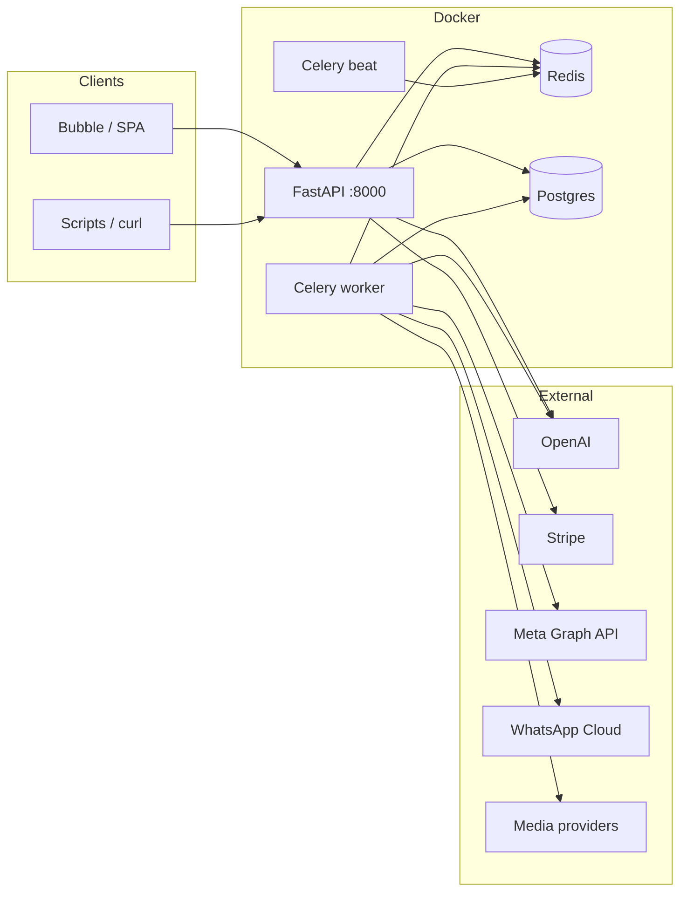
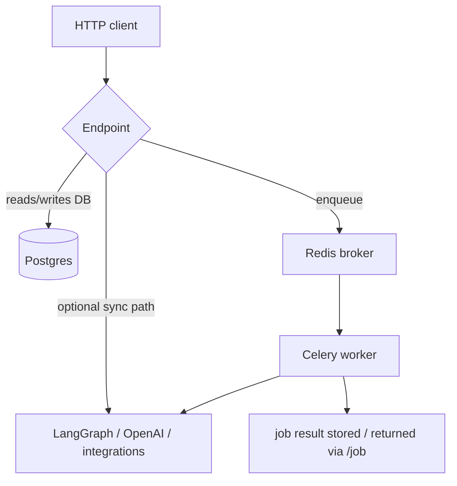
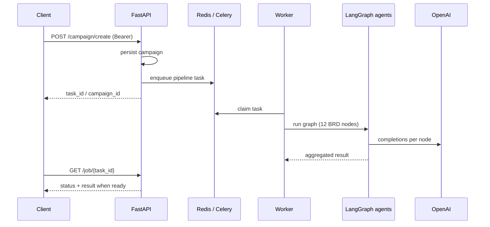
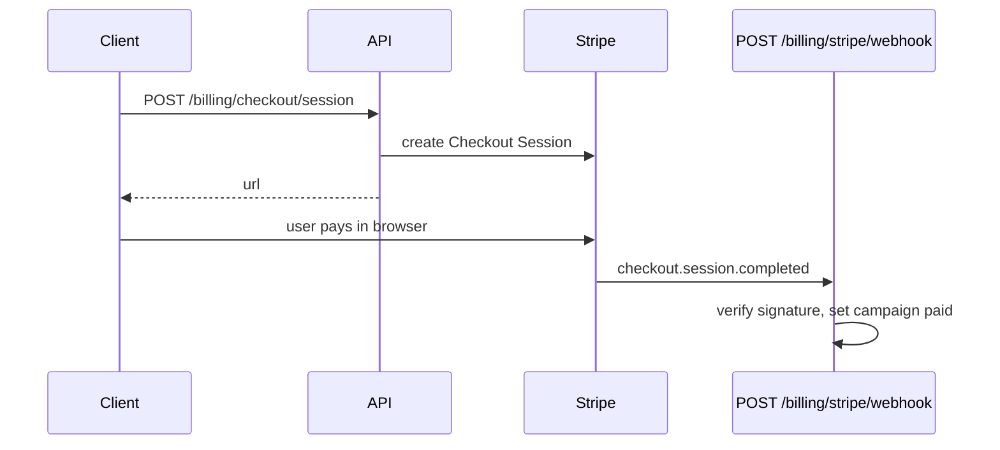
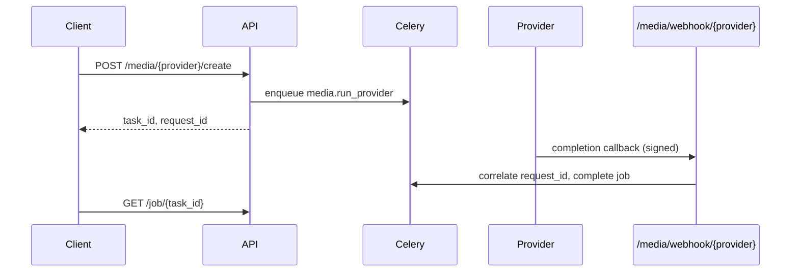
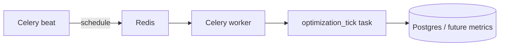

# AIMOS Enterprise (Real API Mode)

## Plug & Play (start here)

| Step | What to run |
|------|-------------|
| **1 — Local stack** | `./setup.sh` or **`make up`** — copies `.env` from `.env.example` if missing, runs `scripts/validate_env.py`, builds and starts Docker Compose (Postgres + Redis + API + worker + beat), waits for `/health/ready`, runs **`scripts/db_init.py`** inside the API container (dev user `aimos-dev@example.com`). |
| **2 — Docs** | Open **http://localhost:8000/docs** — you should see: `AIMOS is ready → …` in the terminal when setup finishes. |
| **3 — E2E campaign** | Set a real **`OPENAI_API_KEY`** in `.env`, restart workers (`docker compose restart worker`), then **`python3 scripts/test_full_campaign.py`** — creates a campaign, waits for the Celery job, checks **12-agent** `agent_outputs`. **Sample success output:** [`docs/E2E_TESTING.md`](docs/E2E_TESTING.md). |
| **4 — AWS deploy** | Configure `infra/aws/terraform/terraform.tfvars`, then **`chmod +x scripts/deploy_aws.sh && ./scripts/deploy_aws.sh`** — Terraform apply → ECR push → ECS rolling restart. Outputs **ALB URL** for Bubble. |
| **5 — Bubble** | **`docs/bubble/README.md`** + **`docs/bubble/WORKFLOWS.md`** — OpenAPI import, CORS, JWT, workflow templates. |

**Utilities:** `make validate` · `make seed` · `make e2e` · `make openapi` · [`docs/BUBBLE_INTEGRATION_GUIDE.md`](docs/BUBBLE_INTEGRATION_GUIDE.md)

---

AI Marketing Operating System — **FastAPI** backend with JWT auth, Stripe billing, a **12-agent LangGraph** pipeline (prompts in `prompts/`), Celery workers, optional **launch** integrations (Meta, WhatsApp, Google Ads stub), and media provider hooks (AdCreative / Pictory / ElevenLabs style).

**BRD alignment:** The product vision (Bubble for UX, 12 AI modules end-to-end) is unchanged. This repo is the **production execution layer** — orchestration, jobs, retries, integrations, and scheduled work — so parallel creatives, multi-step flows, and optimization scale without overloading Bubble. Full narrative, phased roadmap, and cost bands: **[`docs/PRODUCT_ARCHITECTURE.md`](docs/PRODUCT_ARCHITECTURE.md)**.

| Phase (indicative) | Focus | Timeline |
|--------------------|--------|----------|
| **1 — MVP** | Core campaign flow: strategy → content → approval → launch | ~2–3 weeks |
| **2** | Execution + lead capture (ads, landing, WhatsApp, etc.) | +2–3 weeks |
| **3** | Analytics + optimization loop | +3–4 weeks |

**Rough MVP monthly cost band (India):** ~₹30k–₹50k combined (AWS + Bubble + AI/media APIs); **AI usage is the main variable**. See the doc above for breakdown.

---

## Repository layout (modular)

| Path | Purpose |
|------|---------|
| `prompts/` | **Prompt assets** — `system/` (global JSON rules) + `agents/<id>/config.json` & `task.md` (per-agent; edit without touching Python). |
| `backend/` | **Application** — FastAPI `main.py`, `routers/`, `services/` (agents, integrations, **prompt loader**), `core/`, `tasks`, DB models. |
| `scripts/` | **Dev/ops** — `setup.sh` / `validate_env.py` / `db_init.py` / `test_full_campaign.py` / `deploy_aws.sh` / `export_openapi.py`. |
| `docs/bubble/` | **Bubble kit** — OpenAPI export, CORS/auth notes, workflow templates (`README.md`, `WORKFLOWS.md`). |
| `infra/aws/terraform/` | **AWS (Terraform)** — VPC, RDS Postgres, ElastiCache Redis, ECR, ECS Fargate (api / worker / beat), ALB, Secrets Manager. See `infra/aws/terraform/README.md`. |
| `docs/` | **Product & architecture** — `PRODUCT_ARCHITECTURE.md`; **E2E** — `E2E_TESTING.md` (expected campaign test output). |
| Root | `Dockerfile`, `docker-compose.yml`, `.env.example`. |

Agent **code** stays thin (`services/agents/*.py`); **wording and schemas** live under `prompts/agents/`.

---

## Quick start (instructions)

1. **Prerequisites:** [Docker](https://docs.docker.com/get-docker/) and Docker Compose. **Python 3.10** matches the `Dockerfile` (`.python-version`); use it for a local venv if you develop outside Docker.
2. **Configure environment**
   - Copy `.env.example` to `.env` in the project root. Settings resolve `backend/.env` then **repo root `.env`** (later wins); running `uvicorn` from `backend/` still loads the root file.
   - Set at minimum: `DATABASE_URL`, `REDIS_URL`, `OPENAI_API_KEY`, `JWT_SECRET`.
   - For the default `docker-compose` Postgres, you can use:
     - `DATABASE_URL=postgresql://user:password@db:5432/aimos`
     - `REDIS_URL=redis://redis:6379/0`
3. **Run the stack**

   ```bash
   docker-compose up --build
   ```

   Services: **api** (port `8000`), **worker** (Celery), **beat** (scheduled tasks), **redis**, **db** (Postgres).

4. **Verify**
   - [http://localhost:8000/](http://localhost:8000/) — JSON with `docs` and `openapi` links
   - [http://localhost:8000/docs](http://localhost:8000/docs) — Swagger UI
   - [http://localhost:8000/health/ready](http://localhost:8000/health/ready) — DB + Redis check

5. **Local dev with hot-reload**: The `docker-compose.yml` mounts `./backend`, `./scripts`, and `./prompts` as volumes. Changes to these directories will be reflected immediately in the running containers.
6. **Local dev without JWT** (never in production): set `AUTH_DISABLED=1` in `.env` so `/admin/*`, `/campaign/*`, `/agents/*`, `/launch/*`, and `/creatives/*` skip token checks.

**Local venv (optional, no Docker):** `python3.10 -m venv venv && source venv/bin/activate && pip install -r backend/requirements.txt`, then from `backend/`: `uvicorn main:app --reload --host 0.0.0.0 --port 8000` (with Postgres + Redis running and `.env` at repo root). Celery: `celery -A celery_app.celery worker` and `celery -A celery_app.celery beat` in separate shells from `backend/`.

---

## Environment variables (summary)

| Group | Variables | Notes |
|-------|-----------|--------|
| **Core** | `DATABASE_URL`, `REDIS_URL`, `OPENAI_API_KEY`, `LOG_LEVEL` | Required for normal startup. |
| **Auth** | `JWT_SECRET` | Required unless you only use `AUTH_DISABLED=1` locally. |
| **CORS / docs** | `CORS_ORIGINS`, `PUBLIC_API_BASE_URL` | Optional; Bubble or browser clients. |
| **Billing** | `STRIPE_SECRET_KEY`, `STRIPE_WEBHOOK_SECRET`, `STRIPE_DEFAULT_PRICE_ID` | Optional; needed for checkout + webhook. |
| **Media** | `ADCREATIVE_*`, `PICTORY_*`, `ELEVENLABS_*`, `MEDIA_WEBHOOK_TOKEN`, webhook secrets | See [Media API Keys](#media-api-keys). `MOCK_MEDIA_PROVIDER=1` mocks providers (api + worker). |
| **Launch** | `META_*`, `WHATSAPP_*`, `GOOGLE_ADS_*` | Optional; see `.env.example` comments. |

Full list and comments: **`.env.example`**.

---

## AWS (Terraform)

Production-style AWS deployment is defined under **`infra/aws/terraform/`**: VPC (public/private + NAT), RDS PostgreSQL, ElastiCache Redis, ECR, three **ECS Fargate** services (FastAPI **api**, Celery **worker**, Celery **beat**), an **Application Load Balancer** (HTTP → API), and **Secrets Manager** for DB/Redis/OpenAI/JWT.

1. Configure `terraform.tfvars` from `terraform.tfvars.example` (set `openai_api_key` and `jwt_secret` at minimum).
2. Run `terraform init` / `plan` / `apply` from that directory.
3. Push the Docker image to the ECR URL from `terraform output`, then **force a new ECS deployment** so tasks pull `:latest`.

Details, ECR login, and `aws ecs update-service` commands: **`infra/aws/terraform/README.md`**.

---

## Architecture

High-level components and how they connect:



---

## Flows

### Synchronous vs asynchronous work

- **Synchronous in the API process:** auth validation, DB reads/writes, enqueue to Redis, some integration calls when `async_job: false`.
- **Asynchronous (Celery):** long-running agent graphs, media jobs, launch tasks when `async_job: true`, parallel creative variations. Clients poll **`GET /job/{task_id}`** for task status.



### Campaign create → 12-agent pipeline (conceptual)



### Billing (Stripe)



### Media job + signed webhook



### Scheduled optimization (Celery Beat)

**beat** triggers **`optimization_tick`** on a schedule (hourly). Today this is a placeholder you can replace with real metrics and rules when ad APIs and analytics are connected.



---

## APIs

GET `/health/live` — process alive (load balancers)  
GET `/health/ready` — Postgres + Redis connectivity

**Auth (JWT)** — set `JWT_SECRET` in `.env`. Use `AUTH_DISABLED=1` **only** for local dev (skips JWT on `/campaign/*`, `/agents/*`, `/launch/*`, `/creatives/*`).

POST `/auth/register` — body: `email`, `password`, optional `full_name`, `role` (`agency_client` | `end_customer`). Create `platform_admin` users via DB seed (`scripts/db_init.py`), not public register.  
POST `/auth/login`  
GET `/auth/me` — Bearer token

### Admin API
Protected by `platform_admin` role.
- `GET /admin/users` — List all users + quotas.
- `GET /admin/users/{user_id}` — Detailed profile + monthly usage summary.
- `PATCH /admin/users/{user_id}` — Update `role`, `monthly_campaign_quota`, or `monthly_token_quota`.

POST `/billing/checkout/session` — create Stripe Checkout (returns `url`). Body: `campaign_id`, `success_url`, `cancel_url`, optional `price_id` (else `STRIPE_DEFAULT_PRICE_ID`). Sets campaign `pending_payment` until webhook fires.

POST `/billing/stripe/webhook` — Stripe webhook (requires `STRIPE_SECRET_KEY` + `STRIPE_WEBHOOK_SECRET`). On `checkout.session.completed`, sets campaign `paid` when `metadata.campaign_id` is present.

### Bubble.io API Connector

1. Deploy this API with a public HTTPS URL (same origin you put in `PUBLIC_API_BASE_URL`).
2. In Bubble: **Plugins → API Connector** → add API → import from URL: `https://<your-host>/openapi.json` (or paste JSON from `/openapi.json`).
3. Set shared headers: `Authorization: Bearer <token>` from a login workflow (`POST /auth/login`).
4. Set **CORS**: add your Bubble app origin to `CORS_ORIGINS` in `.env` (comma-separated), e.g. `https://yourapp.bubbleapps.io`.
5. For payments: call `POST /billing/checkout/session`, then **open external site** to the returned `url` (Stripe Checkout).

POST `/campaign/create` — Bearer (agency/admin); stores `campaigns` row and runs 12-agent pipeline  
GET `/campaign/{campaign_id}`  
PATCH `/campaign/{campaign_id}` — body: `{ "status": "..." }` for approvals / lifecycle

GET `/launch/status` — which integrations have env configured (booleans)  
POST `/launch/meta` — Meta Marketing API draft campaign (`META_ACCESS_TOKEN`, `META_AD_ACCOUNT_ID`)  
POST `/launch/whatsapp` — WhatsApp Cloud API text (`WHATSAPP_CLOUD_TOKEN`, `WHATSAPP_PHONE_NUMBER_ID`)  
POST `/launch/google` — Google Ads placeholder (requires `GOOGLE_ADS_*`; full RPC via `google-ads` lib later)

POST `/creatives/variations` — parallel OpenAI copy tasks (`n` 1–10); returns `task_ids` to poll with `/job/{task_id}`

GET `/job/{task_id}`  
GET `/agents` — includes `prompt_bundles` (BRD-aligned folders under `prompts/agents/`)  
POST `/agents/{agent_name}/run` — graph node id, e.g. `business_analyzer`, `content_studio`, …  
POST `/media/adcreative/create`  
POST `/media/pictory/create`  
POST `/media/elevenlabs/create`  
POST `/media/webhook/{provider}`

Media create endpoints enqueue a single Celery task (`media.run_provider`) and write an audit row to `job_audits` (task id, provider, `request_id`, input snapshot).

---

## Implemented Agent Pipeline (12) — BRD module names

1. `business_analyzer` — AI Business Analyzer
2. `brand_builder` — AI Brand Builder
3. `content_studio` — AI Content Studio
4. `campaign_builder` — AI Campaign Builder
5. `social_media_manager` — AI Social Media Manager
6. `lead_capture` — AI Lead Capture System
7. `sales_agent` — AI Sales Agent
8. `customer_engagement` — AI Customer Engagement Engine
9. `analytics_engine` — AI Analytics Engine
10. `optimization_engine` — AI Optimization Engine
11. `growth_planner` — AI Growth Planner
12. `business_dashboard` — AI Business Dashboard (summary for UI)

---

## Media API Keys

Set these in `.env` before using media endpoints:

- `ADCREATIVE_API_KEY`
- `PICTORY_API_KEY`
- `ELEVENLABS_API_KEY`

- `MEDIA_WEBHOOK_TOKEN` (optional but recommended for webhook auth)

Webhook flow: each `/media/*/create` returns a `request_id`; providers should echo this as `request_id` or `metadata.request_id` in webhook payloads to map completion correctly.

Provider webhook signature secrets:

- `ADCREATIVE_WEBHOOK_SECRET`
- `PICTORY_WEBHOOK_SECRET`
- `ELEVENLABS_WEBHOOK_SECRET`

Signature headers expected:

- adcreative: `x-adcreative-signature`
- pictory: `x-pictory-signature`
- elevenlabs: `x-elevenlabs-signature`

Signature format: lowercase hex HMAC-SHA256 over raw request body with provider secret. Header names are defined once in `backend/services/integrations/webhook_constants.py` (scripts import the same module to avoid drift).

---

## Operations

- `LOG_LEVEL` — stdout logging level (default `INFO`).
- DB: SQLAlchemy `create_all` runs on API startup (`job_audits`). For production schema migrations, add Alembic when you need versioned DDL.

---

## Local Webhook Test

Use the helper script to simulate signed callbacks:

`python3 scripts/send_test_webhook.py --provider adcreative --secret "$ADCREATIVE_WEBHOOK_SECRET"`

You can switch provider (`adcreative|pictory|elevenlabs`) and pass `--request-id` to match a specific media job.

---

## E2E: create → signed webhook → job success

Full flow (requires API + Redis + Celery worker running, e.g. `docker-compose up --build`):

1. Set the matching provider webhook secret in `.env` (e.g. `ADCREATIVE_WEBHOOK_SECRET`).
2. For local runs **without** paid media API keys, set `MOCK_MEDIA_PROVIDER=1` for **both** `api` and `worker` services.
3. Run:

`python3 scripts/e2e_media_webhook.py --provider adcreative --webhook-secret "$ADCREATIVE_WEBHOOK_SECRET"`

The script calls `POST /media/{provider}/create`, sends a signed `POST /media/webhook/{provider}` with the returned `request_id`, then polls `GET /job/{task_id}` until Celery reports `SUCCESS`.

---

## To-Do

- **Stripe → quotas** — Map subscription / price tier to default monthly campaign and token limits (webhook or sync job updates user rows when checkout or billing changes).
- **Analytics Visuals** — Connect `analytics_engine` outputs to a real BI tool or custom dashboard components.
