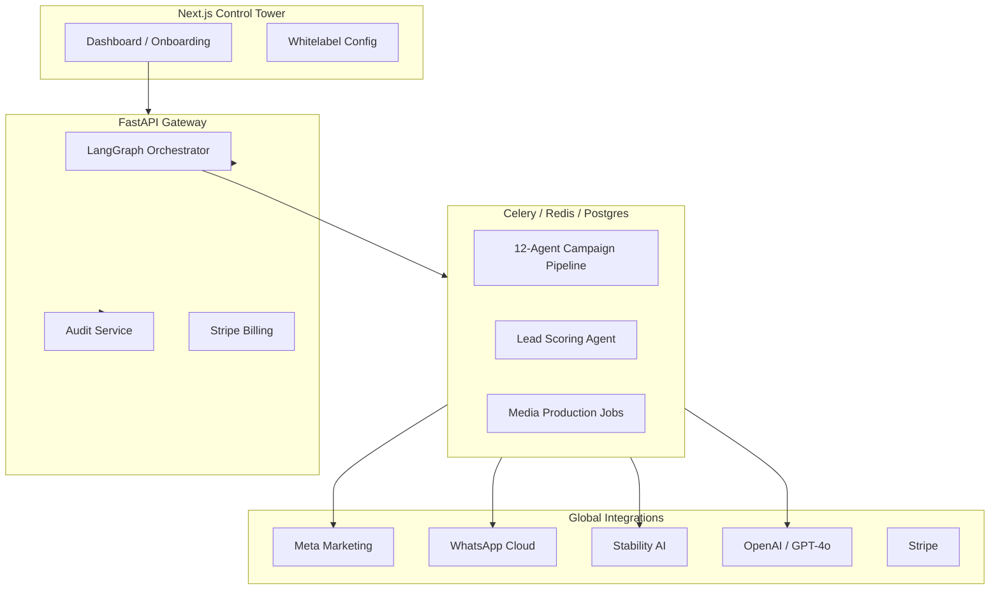

# AIMOS Enterprise — AI Marketing Operating System

[](https://github.com/pranaya-mathur/AIMOS)
[](docs/PRODUCT_ARCHITECTURE.md)
[](LICENSE)

**AIMOS Enterprise** is the world’s first autonomous, end-to-end AI Marketing Operating System. It orchestrates a sophisticated multi-agent pipeline to transform raw business goals into revenue-generating campaigns, complete with creative production, omnichannel launch, and AI-driven sales engagement.

---

## 🚀 The 5 Pillars of AIMOS (Current State)

We have successfully completed the core enterprise foundation, spanning five major milestones:

### 1. Smart Onboarding & Strategy (M1)
*   **Vertical Specialization**: Tailored onboarding for D2C, SaaS, Creator, and Local Business.
*   **Strategic Goal Mapping**: Automated alignment between monthly budgets and marketing objectives (Leads, Sales, Awareness).
*   **Context Injection**: Dynamic "Expertise" injection for high-conversion niches (Real Estate, Dental, SaaS).

### 2. AI Brand Builder & Creative Engine (M2)
*   **Stability AI Integration**: Automated logo and brand asset generation.
*   **Multi-Agent Brand Strategy**: Orchestrated strategy creation (Mission → Positioning → Visual DNA).
*   **Media Asset Management**: Persistent storage and indexing of all AI-generated content.

### 3. Content Studio & Scale (M3)
*   **Omnichannel creative production**: Integrated AdCreative.ai (banners), Pictory (video), and ElevenLabs (voice).
*   **The Command Tower**: A high-fidelity Dashboard with real-time conversion tracking, ROI trends, and CPL analytics.
*   **Campaign Lifecycle**: 4-step wizard for structured launches across Meta and Google Ads.

### 4. Lead Intelligence & AI Sales (M4)
*   **Omniscience Webhooks**: Real-time Lead capture via WhatsApp Cloud API and Email.
*   **Intent Scoring**: Automated lead qualification powered by the `LeadScoringAgent` (Score, Intent, Sentiment).
*   **Smart Replies**: AI-assisted conversation drafts for instant customer engagement.

### 5. Enterprise Governance & Hardening (M5)
*   **Hardened 2.0 Orchestration**: State-of-the-art iteration control featuring **Human-in-the-Loop** pause signals for strategy refinement.
*   **Predictive Benchmarking**: Real-time performance forecasting (CTR/CPL) grounded in industry-specific ground truth.
*   **Autonomous Autopilot**: Governance-safe auto-execution of high-confidence optimizations with a 5-minute recovery grace window.
*   **Security & Audit**: Immutable governance logs, global HSTS protection, and organization-level whitelabeling controls.

---

## 🏗️ Architecture Detail

AIMOS leverages a distributed agentic architecture to separate the "Brain" from the "Execution".



---

## 🛠️ Getting Started

### 1. Local Stack (Docker Compose)
The easiest way to get AIMOS running is via Docker Compose:

```bash
# Clone the repository
git clone https://github.com/pranaya-mathur/AIMOS.git
cd AIMOS

# Configure Environment
cp .env.example .env
# Important: Set OPENAI_API_KEY and STABILITY_API_KEY in .env

# Start the stack
./setup.sh  # Validates env, starts containers, and seeds the DB
```

### 2. Verification & Testing
Run the comprehensive master validation suite to ensure your environment is healthy:

```bash
# Verify the entire E2E flow (M1-M5)
python3 scripts/master_e2e_validation.py
```

---

## 📑 Core APIs

| Endpoint | Method | Purpose | Role |
| :--- | :--- | :--- | :--- |
| `/brand/generate-kit` | `POST` | Triggers multi-agent brand strategy | Agency |
| `/campaign/create` | `POST` | Launches a full 12-agent pipeline | Agency |
| `/org/config` | `PATCH` | Updates Whitelabel branding | Admin |
| `/leads` | `GET` | Retrieves AI-scored leads and intent | Agency |
| `/analytics/global` | `GET` | High-level ROI and revenue dashboard | Agency |

---

## 🛡️ Enterprise Security & Hardening
AIMOS Enterprise is built with a "Security-First" mindset:
*   **JWT RBAC**: Strict Role-Based Access Control (`platform_admin`, `agency_client`).
*   **HSTS & XSS Protection**: Global middleware enforcing secure headers on all API responses.
*   **Rate Limiting**: Endpoint-level protection via `SlowAPI` to prevent DDoS and API abuse.
*   **Quota Enforcement**: Hard usage caps per subscription tier managed via Stripe.

---

## 🔮 Roadmap & Future State
- [x] **Hardened 2.0 Orchestration**: Human-in-the-loop, Benchmarking, and Autopilot.
- [ ] **Competitive Spy Agent**: Real-time competitor ad intelligence feeding directly into content loops.
- [ ] **Agent Memory 2.0**: Long-term vector-based memory for cross-campaign historical learning.
- [ ] **Custom Domain Routing**: Automated subdomain provisioning for secondary Whitelabel tenants.

---

## 🤝 Contributing
AIMOS is an enterprise-grade system. For major changes, please open an issue first to discuss what you would like to change.

1. Fork the Project
2. Create your Feature Branch (`git checkout -b feature/AmazingFeature`)
3. Commit your Changes (`git commit -m 'Add some AmazingFeature'`)
4. Push to the Branch (`git push origin feature/AmazingFeature`)
5. Open a Pull Request

---

© 2026 AIMOS Enterprise. Optimized for AWS Fargate & ARM.
