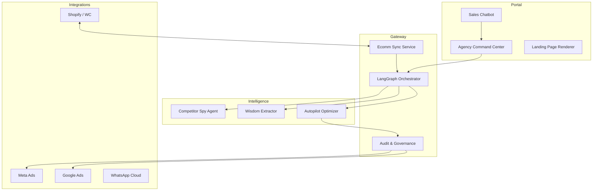

# AIMOS Enterprise — AI Marketing Operating System

[](https://github.com/pranaya-mathur/AIMOS)
[](docs/PRODUCT_ARCHITECTURE.md)
[](LICENSE)

**AIMOS Enterprise** is the definitive Operating System for AI Marketing Agencies. It orchestrates a high-precision, multi-agent pipeline that transforms business objectives into revenue-generating outcomes across the entire marketing funnel—from competitive analysis to autonomous optimization and AI-driven sales engagement.

---

## 🏛️ The Four Pillars of Hardened AIMOS

### 1. Strategic Intelligence & Memory 2.0
*   **Competitor Spy**: Real-time ad intelligence and market grounding for every campaign decision.
*   **Brand Wisdom Layer**: Long-term persistent learning across campaigns—AIMOS "remembers" winning hooks and human preferences.
*   **Unified Seller Profile**: Deep persistence for D2C, SaaS, Creator, and Local Business brands.

### 2. Autonomous Autopilot & Financial Safety
*   **Governance-Safe Optimization**: Autonomous budget shifts and creative rotations with a mandatory **5-minute human-in-the-loop undo window**.
*   **Financial Hard Caps**: Per-organization "Autopilot Constraint" policies to prevent runaway spending.
*   **Inventory Guard**: Real-time sync with **Shopify & WooCommerce** catalog; automatically pauses ads for out-of-stock items.

### 3. Full-Funnel Conversion Engines
*   **AI Landing Page Renderer**: High-fidelity, conversion-optimized pages generated in seconds with auto-validating forms.
*   **Sales Intelligence Chatbot**: Context-aware qualification agents that capture leads, score intent, and handle FAQs 24/7.
*   **Multi-Channel Engagement**: Automated lead nurturing via WhatsApp, Email, and SMS.

### 4. Enterprise Governance & Admin
*   **Organization-Level Silos**: Rigid data isolation and RBAC for multi-tenant agency management.
*   **Multi-Persona Approval**: High-risk budget directives require "Co-Signing" from senior agency stakeholders.
*   **Portfolio Command Tower**: Aggregated performance monitoring (Spend, ROAS, Revenue) across a brand portfolio.

---

## 🏗️ Architecture Detail

AIMOS leverages a distributed agentic architecture (LangGraph) backed by a hardened enterprise execution layer.



---

## 🛠️ Performance & Scalability
*   **FastAPI & LangGraph**: High-throughput asynchronous orchestration.
*   **Celery & Redis**: Distributed task execution for media generation and inventory monitoring.
*   **Postgresql & JSONB**: Hybrid structured/unstructured storage for complex agent memories.
*   **Stripe Managed Quotas**: Credit-based usage enforcement and per-tier rate limiting.

---

## 🚀 Getting Started

### 1. Local Environment Setup
```bash
# Clone and enter
git clone https://github.com/pranaya-mathur/AIMOS.git
cd AIMOS

# Configure Environment
cp .env.example .env
# Required: OPENAI_API_KEY, STABILITY_API_KEY, META_ACCESS_TOKEN

# Initialize Stack
./setup.sh  # Validates env, initializes DB, and starts persistent services
```

### 2. Enterprise Verification
Run the master validation suite to ensure your organization's environment is healthy:
```bash
python3 scripts/master_e2e_validation.py
```

---

## 🛡️ Security & Compliance
*   **RBAC Siloing**: Users are strictly partitioned by `organization_id`.
*   **HSTS & Middleware**: Enforced secure headers across the entire API surface.
*   **Audit Logging**: Every optimization and financial shift is logged to an immutable audit trail.
*   **Multi-Sig Approvals**: Financial risk management via mandatory co-signing for large budget shifts.

---

## 🤝 Contributing
For major architectural changes, please open an issue first. All contributions must adhere to the Project's E2E testing standards.

1. Fork the Project
2. Create your Feature Branch (`git checkout -b feature/AmazingFeature`)
3. Commit your Changes (`git commit -m 'Add some AmazingFeature'`)
4. Open a Pull Request

---

© 2026 AIMOS Enterprise. Optimized for AWS Fargate & Agency-Scale Deployment.
