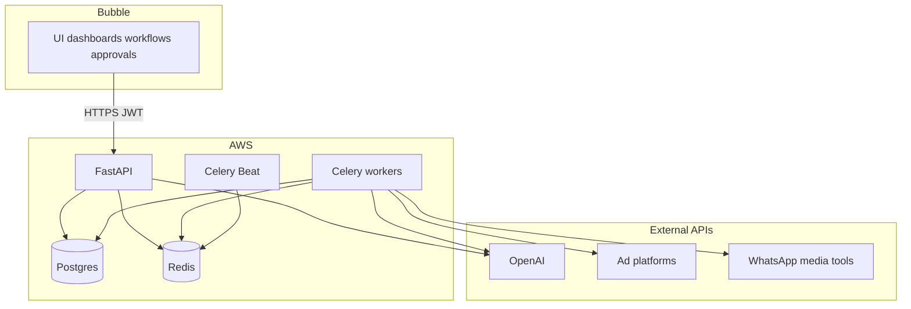

# AIMOS — BRD to production architecture

This document aligns the **BRD vision** (12 AI modules, Bubble-first product) with the **implementation** in this repository. It does not replace the BRD; it explains *how* we deliver it reliably.

## What stays the same (BRD product vision)

- End-to-end **marketing operating system** with **12 AI modules** (names and roles as in the BRD).
- **Bubble** as the primary **no-code** surface for speed: UI, dashboards, campaign creation, approvals, and user workflows.

## What we add (execution layer)

Building the same capabilities *only* inside Bubble workflows becomes fragile where we need concurrency, long-running jobs, retries, and scheduled work. The refinement is:

| Layer | Responsibility |
|--------|----------------|
| **Bubble** | UI, dashboards, campaign UX, approvals, routing users through flows, calling this API (API Connector). |
| **Backend (this repo)** | **FastAPI** for HTTP, auth, billing hooks; **LangGraph** for multi-step AI orchestration; **Celery + Redis** for parallel work, retries, and **Celery Beat** for scheduled optimization ticks; **Postgres** for durable campaign/job state. |
| **AWS** | Host API, workers, scheduler, database, cache, and container images (see `infra/aws/terraform/`). Integrations and AI calls run from workers/API, not from Bubble. |

This keeps the BRD’s *product* shape while putting *execution* where it scales.

## Why this split (justification)

1. **Parallel processing** — Multiple creative variations per campaign need **concurrent tasks** and **job IDs** (`/job/{task_id}`), not a single Bubble workflow thread.
2. **Multi-step orchestration** — Chains like strategy → content → approval → payment → launch → optimization need **stateful** graphs and DB-backed status, so partial failures do not corrupt campaign state.
3. **External API reliability** — Ad platforms and AI APIs are **non-deterministic** and rate-limited. The backend centralizes **retries**, logging, and idempotent patterns; Bubble triggers actions, it does not retry Meta/WhatsApp/OpenAI internally.
4. **Continuous optimization** — Pause / boost / suggest loops need **scheduled** and **event-driven** processing (e.g. Celery Beat + future metrics ingestion), which fits a backend, not Bubble cron alone.

## Phased delivery (realistic timelines)

| Phase | Scope | Timeline (indicative) |
|-------|--------|-------------------------|
| **Phase 1 — MVP (core campaign flow)** | Strategy → content → approval → campaign launch (API + agents + jobs + Stripe path as needed) | **2–3 weeks** |
| **Phase 2 — Execution + lead capture** | Deeper ad integrations, landing flows, WhatsApp lead capture (`/launch/*`, webhooks) | **+2–3 weeks** |
| **Phase 3 — Analytics + optimization** | Performance tracking, insights, automated optimization (replace placeholder `optimization_tick` with real rules + data) | **+3–4 weeks** |

**Overall:** roughly **6–8 weeks** to a full functional slice; **MVP earlier** for demos and first users once Phase 1 is stable.

Timelines assume a small team, existing API surface, and clear scope per phase; integration depth with each ad network can move dates.

## Cost expectations (monthly, indicative — India)

Rough **order-of-magnitude** for an MVP / early usage band (not legal or contractual estimates):

| Category | INR / month (range) | Notes |
|----------|---------------------|--------|
| **AWS** (backend, DB, cache, modest traffic) | ₹12k – ₹20k | Grows with traffic, RDS size, and NAT/ALB patterns. |
| **Bubble** | ₹5k – ₹8k | Plan-dependent. |
| **AI + media APIs** (OpenAI, creative/video/voice providers) | ₹10k – ₹20k | **Primary variable**; scales with generations and tool usage. |

**Total MVP band (rough):** **₹30k – ₹50k / month**, with **AI/media usage** as the main driver; infra and Bubble stay comparatively stable until scale.

## How this maps to the repo

- **12 agents** — `prompts/agents/*` + LangGraph orchestration in `backend/services/`.
- **Jobs & parallelism** — Celery tasks, `/job/*`, `/creatives/variations`.
- **Launch & integrations** — `backend/services/integrations/*`, `/launch/*`.
- **Optimization loop** — `optimization_tick` in Celery Beat (extend in Phase 3).
- **Bubble** — Documented in root `README.md` (CORS, OpenAPI import, JWT).

---

*This file is the working alignment between BRD intent and implementation; update it when phases or cost assumptions change.*
