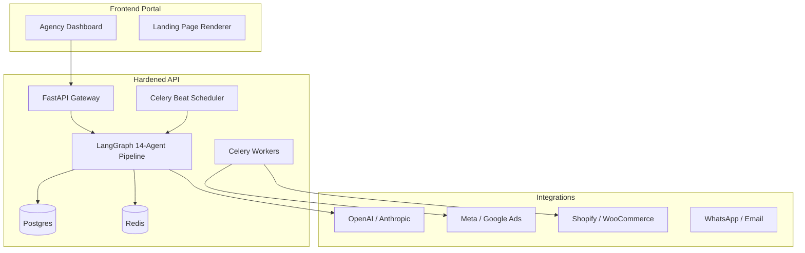

# AIMOS — Production Architecture

This document aligns the **Enterprise Vision** (14 AI agents, Multi-platform product) with the **implementation** in this repository. 

## Platform Overview

- End-to-end **marketing operating system** with **14 AI agents** (Specialized roles from market research to autonomous optimization).
- **Multi-Tenant Command Center**: High-fidelity UI for agency management, campaign orchestration, and lead conversion.

## Infrastructure Stack

| Layer | Responsibility |
|--------|----------------|
| **Frontend** | Agency Command Center (Next.js), Landing Page Renderer, Lead Capture UI. |
| **Backend** | **FastAPI** for core API; **LangGraph** for 14-agent orchestration; **Celery + Redis** for parallel media generation and background tasks; **Postgres** for durable brand and campaign state. |
| **Cloud (AWS)** | Host API, workers, scheduler, and database (see `infra/aws/terraform/`). |

## Current State: Hardened 2.0 (April 2026)

The platform has successfully transitioned from MVP to **Hardened 2.0**. All core strategic and financial layers are operational.

| Capability | Implementation Status |
|-----------|----------------------|
| **Unified Seller Profile** | Persistent brand, audience, and product memory. |
| **14-Agent LangGraph** | High-precision pipeline with manual intervention gates. |
| **Autonomous Autopilot** | Financial safety windows and hard spend caps. |
| **Inventory Guardrail** | Automated ad pausing for out-of-stock items via Shopify/WC sync. |
| **Conversion Engine** | Live landing pages and AI sales chatbots. |

## How this maps to the repo

- **14 agents** — `prompts/agents/*` + LangGraph orchestration in `backend/services/orchestrator.py`.
- **Jobs & parallelism** — Celery tasks, `/job/*`, `/creatives/variations`.
- **Launch & integrations** — `backend/services/integrations/*`, `/launch/*`.
- **Optimization loop** — `optimization_tick` in Celery Beat.
